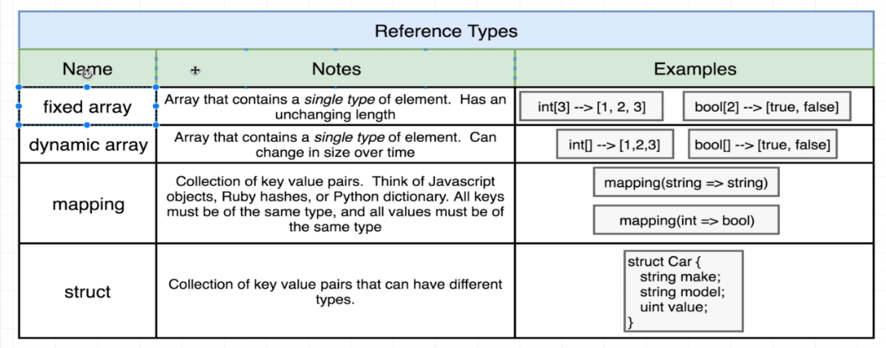

#   71. Overview of Arrays

-   Create `Test.sol`
    ```
    pragma solidity ^0.4.17;

    contract Test {
        uint[] public myArray;

        // function Test() public {
        constructor () public {
            myArray.push(1);
            myArray.push(10);
            myArray.push(30);
        }

        function getMyArray() public view returns (uint[]) {
            return myArray;
        }

        function getArrayLength() public view returns (uint) {
            return myArray.length;
        }

        function getFirstElement() public view returns (uint) {
            return myArray[0];
        }
    }
    ```


---
