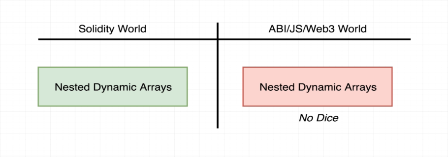
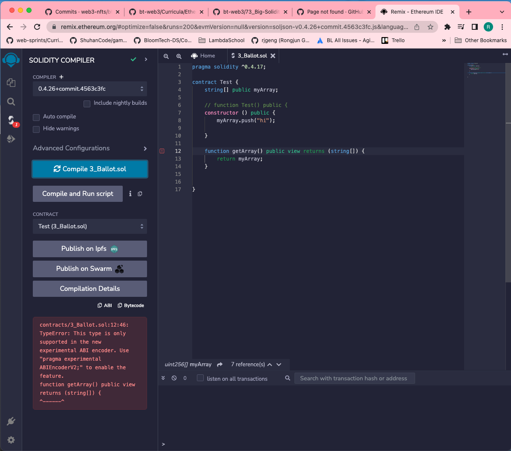

# 73. Big Solidity Gotcha

-   Create `Test.sol`
    ```
    pragma solidity ^0.4.17;

    contract Test {
        string[] public myArray;

        // function Test() public {
        constructor () public {
            myArray.push("hi");
                        
        }

        function getArray() public view returns (string[]) {
            return myArray;
        }
            
    }
    ```


---

---