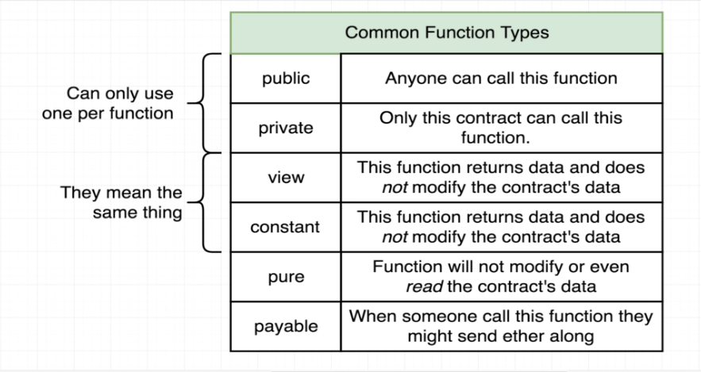

# 74. Entering the Lottery

-   Create `Lottery.sol`
    ```
    pragma solidity ^0.4.17;

    contract Lottery {
        address public manager;
        address[] public players;
        
        // function Lottery() public {
        constructor () public {
            manager = msg.sender;
        }
        function enter() public payable {
            require(msg.value > .01 ether);
            players.push(msg.sender);
        }
    }   
    ```

##  Ref

---

---