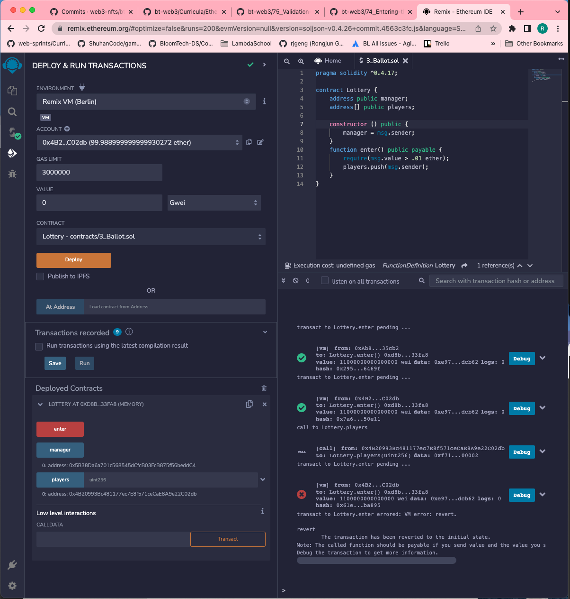

#   75. Validation with Require Statements

---

##  Resources for this lecture

---

-   [Rthereum Unit Converter](https://etherscan.io/unitconverter)

---

-   [76-validation.zip](https://github.com/web3-nfts/bt-web3/raw/main/Curricula/Ethereum-and-Solidity_The_Complete_Developers_Guide/resources/76-validation.zip)