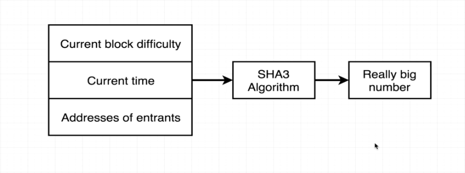

## 77. Pseudo Random Number Generator

-   Create `Lottery.sol`
    ```
    pragma solidity ^0.4.17;

    contract Lottery {
        address public manager;
        address[] public players;
        
        // function Lottery() public {
        constructor () public {
            manager = msg.sender;
        }
        function enter() public payable {
            require(msg.value > .01 ether);
            players.push(msg.sender);
        }
        function random() private view returns (uint) {
            return uint(keccak256(abi.encodePacked(block.difficulty, now, players)));
            
        }
        
    }   



---

<details>
  <summary>Pseudo Random Number Generator - warning and result</summary>    

- [Warning: This function only accepts a single "bytes" argument. Please use "abi.encodePacked(...)" mean](https://ethereum.stackexchange.com/questions/50592/what-does-warning-this-function-only-accepts-a-single-bytes-argument-please)
---

</details>

##  Resources for this lecture

---

-   [76-pseudo.zip](https://github.com/web3-nfts/bt-web3/raw/main/Curricula/Ethereum-and-Solidity_The_Complete_Developers_Guide/resources/76-pseudo.zip)