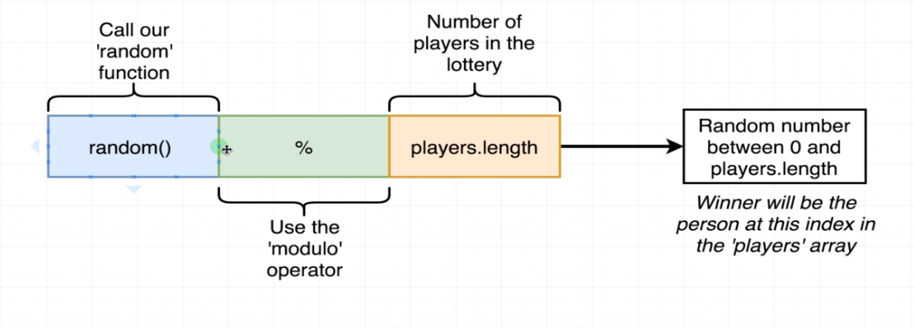

#   78. Selecting a Winner

-   Create `Lottery.sol`
    ```
    pragma solidity ^0.4.17;

    contract Lottery {
        address public manager;
        address[] public players;
        
        // function Lottery() public {
        constructor () public {
            manager = msg.sender;
        }
        function enter() public payable {
            require(msg.value > .01 ether);
            players.push(msg.sender);
        }
        function random() private view returns (uint) {
            return uint(keccak256(abi.encodePacked(block.difficulty, now, players)));            
        }
        function pickWinner() public view {
            uint index = random() % players.length;
            players[index];
        }
        
    } 
    ```  
    

---


