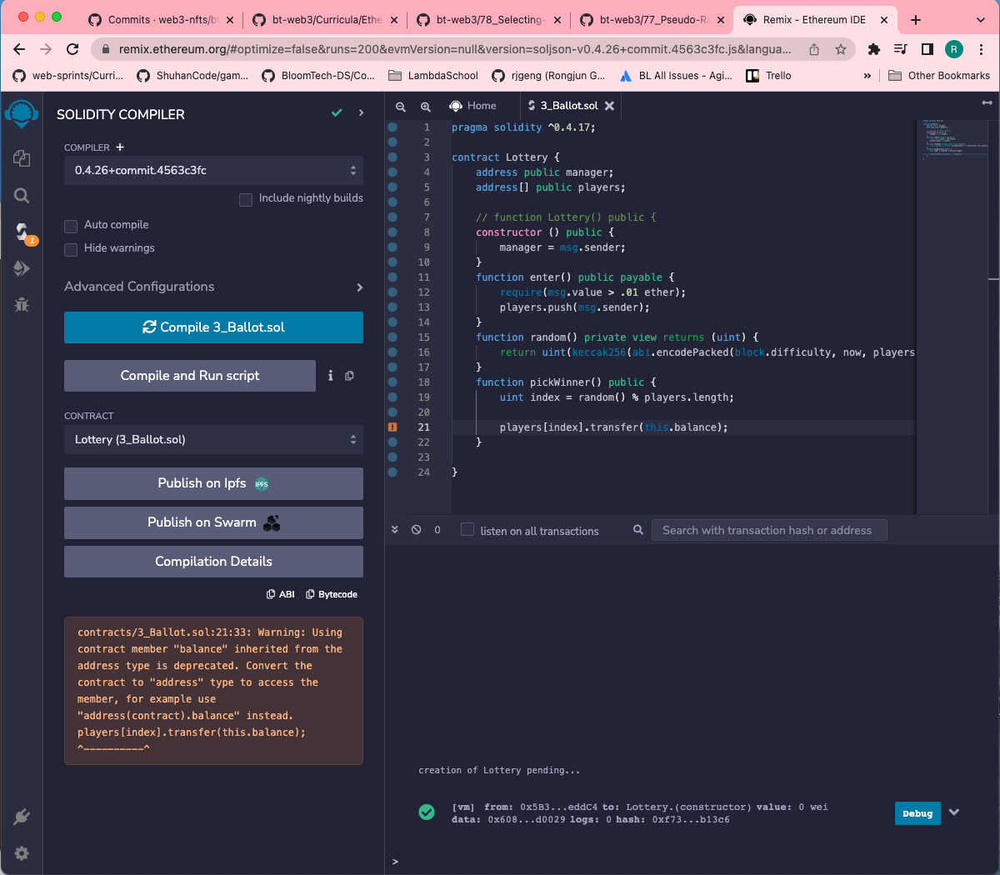

# 79. Sending Ether from Contracts

-   Create `Lottery.sol`
    ```
    pragma solidity ^0.4.17;

    contract Lottery {
        address public manager;
        address[] public players;
        
        // function Lottery() public {
        constructor () public {
            manager = msg.sender;
        }
        function enter() public payable {
            require(msg.value > .01 ether);
            players.push(msg.sender);
        }
        function random() private view returns (uint) {
            return uint(keccak256(abi.encodePacked(block.difficulty, now, players)));            
        }
        function pickWinner() public {
            uint index = random() % players.length;
            // players[index].transfer(this.balance);
            players[index].transfer(address(this).balance);
        }
        
    } 
    ```  

<details>
  <summary>Selecting a Winner - warning and result</summary>    

- [Warning: Using contract member "balance" inherited from the address type is deprecated. Solidity](https://stackoverflow.com/questions/51372365/warning-using-contract-member-balance-inherited-from-the-address-type-is-depr)
---

</details>

##  Resources for this lecture

---

-   [78-sending.zip](https://github.com/web3-nfts/bt-web3/raw/main/Curricula/Ethereum-and-Solidity_The_Complete_Developers_Guide/resources/78-sending.zip)