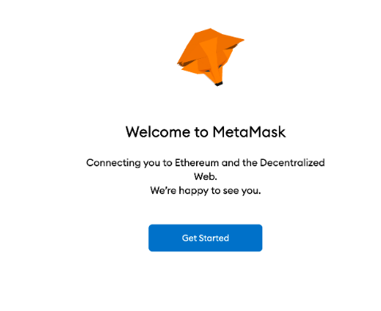
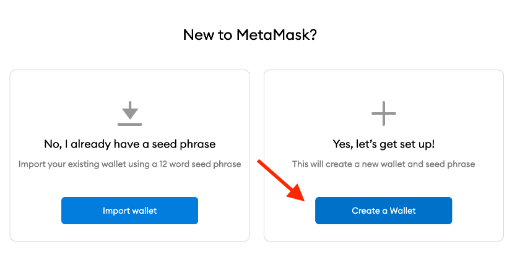
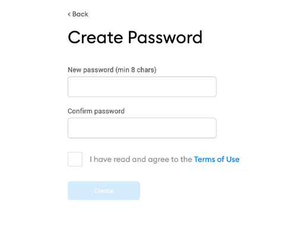
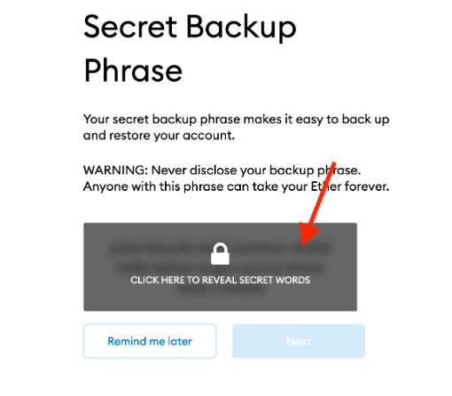
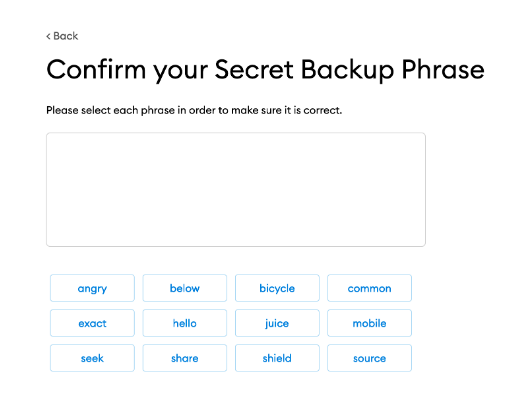
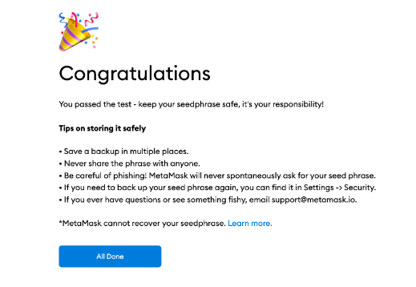
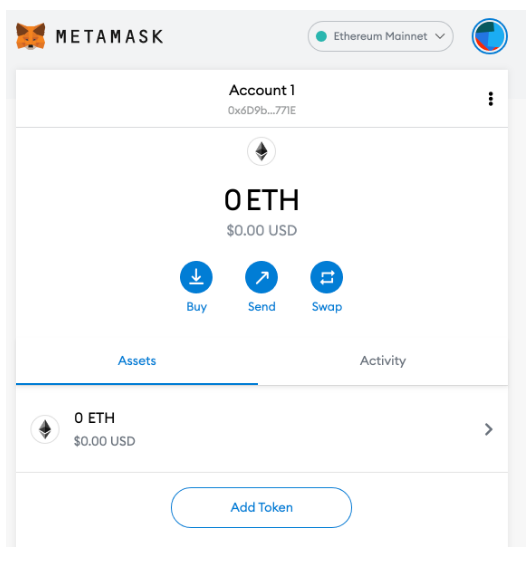
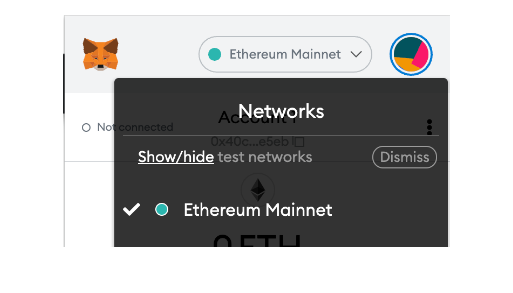
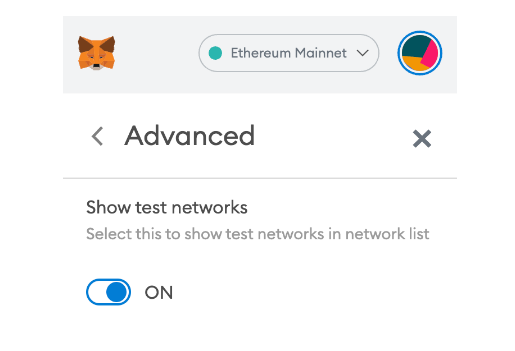

#   7. Updated Metamask Setup for new UI

This note will provide instructions for setting up Metamask with its new UI.

1.  First, install the extension for your specific browser (Chrome or Firefox recommended)

2.  After the extension has been installed, click **Get Started**

 

3.  Choose the **Yes, let's get set up!** option and click **Create a Wallet**

 

4.  Agree to the terms and then enter a password. When finished, click Create

 

5.  Click the box with a padlock to reveal your secret phrase. Copy the secret words somewhere safe, you will need to select them in the correct order on the next screen.

 

6.  Select each word of your secret phrase in the correct order and click **Confirm**.

 

7.  You should get a **Congratulations** message. If so, click **All done**

 

8.  Exit out of any advertisements and you should now be at the Metamask dashboard.

 

9.  Click **Ethereum Mainnet** and select **Show/Hide test networks**

 

10. Toggle the **Show test networks** button to **ON**

 

11. You can now change between networks similarly as shown in the lecture videos.

---

- [7. Updated Metamask Setup for new UI](https://www.udemy.com/course/ethereum-and-solidity-the-complete-developers-guide/learn/lecture/25992072#learning-tools)