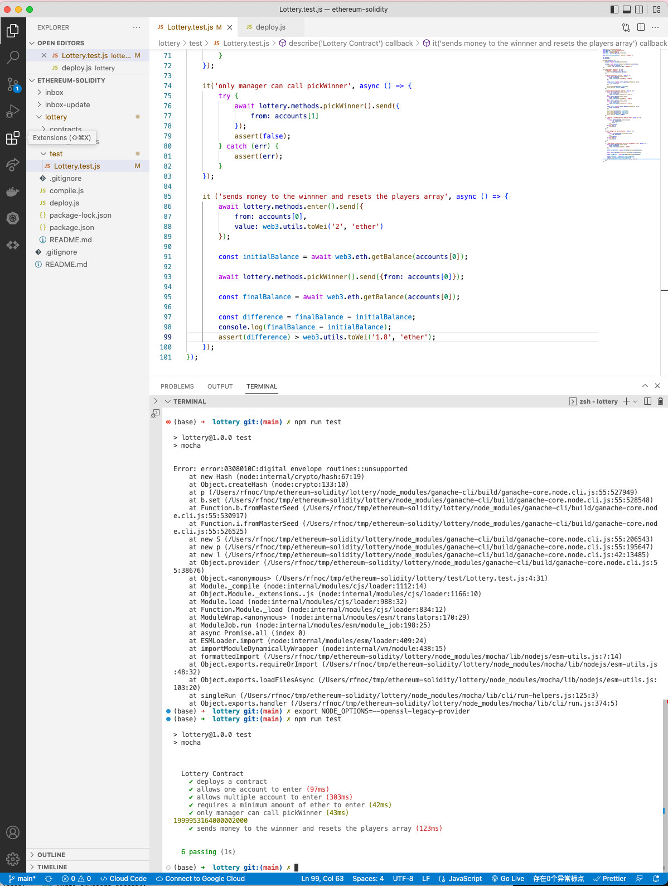

#   94. End to End Test

**Lottery.test.js** - End to End Test

```
const assert = require('assert');
const ganache = require('ganache-cli');
const Web3 = require('web3');
const web3 = new Web3(ganache.provider());

const { interface, bytecode } = require('../compile');

let lottery;
let accounts;

beforeEach(async () => {
    accounts = await web3.eth.getAccounts();

    lottery = await new web3.eth.Contract(JSON.parse(interface))
        .deploy({data: bytecode })
        .send({ from: accounts[0], gas: '1000000' });
});

describe('Lottery Contract', () => {
    it('deploys a contract', () => {
        assert.ok(lottery.options.address);    
    });  
    
    it('allows one account to enter', async () => {
        await lottery.methods.enter().send({
            from: accounts[0],
            value: web3.utils.toWei('0.02', 'ether')
        });

        const players = await lottery.methods.getPlayers().call({
            from: accounts[0]
        });

        assert.equal(accounts[0], players[0]);
        assert.equal(1, players.length);
    });

    it('allows multiple account to enter', async () => {
        await lottery.methods.enter().send({
            from: accounts[0],
            value: web3.utils.toWei('0.02', 'ether')
        });
        await lottery.methods.enter().send({
            from: accounts[1],
            value: web3.utils.toWei('0.02', 'ether')
        });
        await lottery.methods.enter().send({
            from: accounts[2],
            value: web3.utils.toWei('0.02', 'ether')
        });

        const players = await lottery.methods.getPlayers().call({
            from: accounts[0]
        });

        assert.equal(accounts[0], players[0]);
        assert.equal(accounts[1], players[1]);
        assert.equal(accounts[2], players[2]);
        assert.equal(3, players.length);
    });

    it ('requires a minimum amount of ether to enter', async () => {
        try {
            await lottery.methods.enter().send({
                from: accounts[0],
                value: 200
            }); 
            assert(false);
        } catch (err) {
            assert(err);
        }
    });

    it('only manager can call pickWinner', async () => {
        try {
            await lottery.methods.pickWinner().send({
                from: accounts[1]
            });
            assert(false);
        } catch (err) {
            assert(err);
        }
    });

    it ('sends money to the winnner and resets the players array', async () => {
        await lottery.methods.enter().send({
            from: accounts[0],
            value: web3.utils.toWei('2', 'ether')
        });

        const initialBalance = await web3.eth.getBalance(accounts[0]);

        await lottery.methods.pickWinner().send({from: accounts[0]});

        const finalBalance = await web3.eth.getBalance(accounts[0]);

        const difference = finalBalance - initialBalance;
        console.log(finalBalance - initialBalance);
        assert(difference) > web3.utils.toWei('1.8', 'ether');
    });
});
```

**npm run test**
```
npm run test
```

<details>
  <summary>End to End Test - result</summary>

**If the following Error happen**

```
Error: error:0308010C:digital envelope routines::unsupported
    at new Hash (node:internal/crypto/hash:67:19)
    at Object.createHash (node:crypto:130:10)
    at module.exports (/Users/user/Programming Documents/WebServer/untitled/node_modules/webpack/lib/util/createHash.js:135:53)    
    ...
```

**Open terminal and paste these as described :**

-   Linux & Mac OS (windows git bash)-
    ```
    export NODE_OPTIONS=--openssl-legacy-provider
    ``` 

- [Error message "error:0308010C:digital envelope routines::unsupported"](https://stackoverflow.com/questions/69692842/error-message-error0308010cdigital-envelope-routinesunsupported)

---

---
</details>  

##  Resources for this lecture

---

-   [96-end-to-end.zip](https://github.com/web3-nfts/bt-web3/raw/main/Curricula/Ethereum-and-Solidity_The_Complete_Developers_Guide/resources/96-end-to-end.zip)