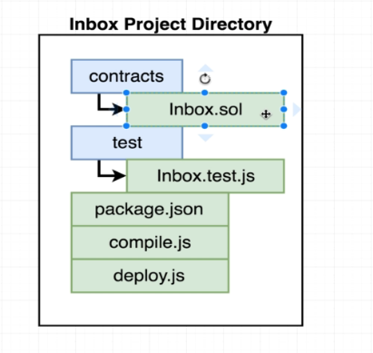

#   How to setup project

##  initialize Project - inbox
-   `mkdir inbox`
-   `cd inbox`
-   `npm init`

##  setup Project - inbox directory

- `mkdir contracts`
    -   `touch inbox.sol`
- `mkdir test`
    -   `touch inbox.test.js`

    

## **create a inbox.sol**
-   `inbox.sol`
    ```
    pragma solidity ^0.4.17;

    contract Inbox {
        string public message;
        
        function Inbox(string initialMessage) public {
            message = initialMessage;
        }
        
        function setMessage(string newMessage) public {
            message = newMessage;
        }    
        
    }
    ```
## **install specific Solidity Compiler 0.4.17**
-   `npm install solc@0.4.17`
   
## **create compile.js**
-   `compile.js`
    ```
    const path = require("path");
    const fs = require("fs");
    const solc = require("solc");

    const inboxPath = path.resolve(__dirname, "contracts", "Inbox.sol");
    const source = fs.readFileSync(inboxPath, "utf8");

    //  console.log(solc.compile(source, 1));
    module.exports = solc.compile(source, 1).contracts[':Inbox'];
    ```

##  in terminal run `node compile.js`

-   in terminal run `node compile.js`

In the upcoming lecture, we will be logging the compilation of our script to the terminal. If you are using **solc 0.4.17** as shown in the course, you may get these warnings:

*Invalid asm.js: Invalid member of stdlib*

or

*':6:5: Warning: Defining constructors as functions with the same name as the contract is deprecated. Use "constructor(...) { ... }" instead.\n' +*

'    function Inbox(string initialMessage) public {\n' +

'    ^ (Relevant source part starts here and spans across multiple lines).\n'

**These specific warnings can be ignored as they will not cause any issues with the compilation or deployment of the contract we are building.**