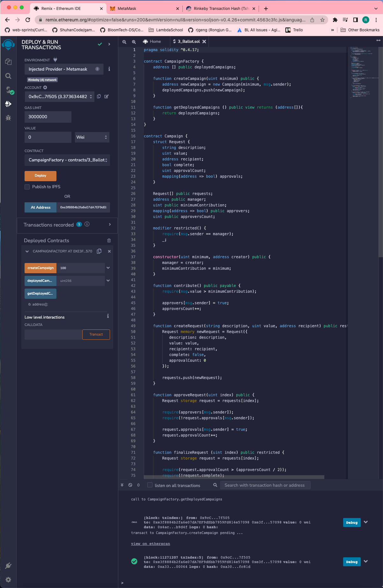

# Kickstart

##  Initialize Project - Kickstart
-   `mkdir kickstart`
-   `cd kickstart`
-   `npm init`

<details>
  <summary>Set up folders and files</summary>


---
</details> 

##  Installing Modules

**install ganache-cli mocha solc@0.4.17 fs-extra web3 @truffle/hdwallet-provider dotenv** 
```
npm install ganache-cli mocha solc@0.4.17 fs-extra web3 @truffle/hdwallet-provider dotenv
```

<details>
<summary>package.json</summary>

```
{
"name": "kickstart",
"version": "1.0.0",
"description": "",
"main": "index.js",
"scripts": {
    "test": "mocha"
},
"author": "",
"license": "ISC",
"dependencies": {
    "@truffle/hdwallet-provider": "^1.7.0",
    "dotenv": "^16.0.1",
    "fs-extra": "^10.1.0",
    "ganache-cli": "^6.12.2",
    "mocha": "^9.2.2",
    "solc": "^0.4.17",
    "web3": "^1.7.5"
}
}
```    
</details>

## Create a Campaign.sol
<details>
  <summary>Campaign.sol</summary>

```
pragma solidity ^0.4.17;

contract CampaignFactory {
    address[] public deployedCampaigns;

    function createCampaign(uint minimum) public {
        address newCampaign = new Campaign(minimum, msg.sender);
        deployedCampaigns.push(newCampaign);
    }

    function getDeployedCampaigns() public view returns (address[]) {
        return deployedCampaigns;
    }
}

contract Campaign {
    struct Request {
        string description;
        uint value;
        address recipient;
        bool complete;
        uint approvalCount;
        mapping(address => bool) approvals;
    }

    Request[] public requests;
    address public manager;
    uint public minimumContribution;
    mapping(address => bool) public approvers;
    uint public approversCount;

    modifier restricted() {
        require(msg.sender == manager);
        _;
    }

    function Campaign(uint minimum, address creator) public {
        manager = creator;
        minimumContribution = minimum;
    }

    function contribute() public payable {
        require(msg.value > minimumContribution);

        approvers[msg.sender] = true;
        approversCount++;
    }

    function createRequest(string description, uint value, address recipient) public restricted {
        Request memory newRequest = Request({
           description: description,
           value: value,
           recipient: recipient,
           complete: false,
           approvalCount: 0
        });

        requests.push(newRequest);
    }

    function approveRequest(uint index) public {
        Request storage request = requests[index];

        require(approvers[msg.sender]);
        require(!request.approvals[msg.sender]);

        request.approvals[msg.sender] = true;
        request.approvalCount++;
    }

    function finalizeRequest(uint index) public restricted {
        Request storage request = requests[index];

        require(request.approvalCount > (approversCount / 2));
        require(!request.complete);

        request.recipient.transfer(request.value);
        request.complete = true;
    }
}
```
</details>  
 
## create test files

<details>
  <summary>Campaign.test.js</summary>

```
const assert = require('assert');
const ganache = require('ganache-cli');
const Web3 = require('web3');
const web3 = new Web3(ganache.provider());

const compiledFactory = require('../ethereum/build/CampaignFactory.json');
const compiledCampaign = require('../ethereum/build/Campaign.json');
const { isTypedArray } = require('util/types');

let accounts;
let factory;
let campaignAddress;
let campaign;

beforeEach(async () => {
    accounts = await web3.eth.getAccounts();

    factory = await new web3.eth.Contract(JSON.parse(compiledFactory.interface))
        .deploy({data: compiledFactory.bytecode })
        .send({ from: accounts[0], gas: '1000000' });

    await factory.methods.createCampaign('100').send({
        from: accounts[0],
        gas: '1000000'
    });

    [campaignAddress] = await factory.methods.getDeployedCampaigns().call();
    campaign = await new web3.eth.Contract(
        JSON.parse(compiledCampaign.interface),
        campaignAddress
    );
});

describe('[Campaigns', () => {
    it('deploys a factory and a campain', () => {
        assert.ok(factory.options.address);
        assert.ok(campaign.options.address);
    });  
    
    it ('marks caller as teh campaign manager', async () => {
        const manager = await campaign.methods.manager().call();
        assert.equal(accounts[0], manager);
    });

    it ('allows people to contribute monfey and marks them as approvers', async () => {
        await campaign.methods.contribute().send({
            value: '200',
            from: accounts[1]
        });  
        const isContributor = await campaign.methods.approvers(accounts[1]).call();  
        assert(isContributor);
    })

    it ('requires a minimum contribution', async () => {
        try {
            await campaign.methods.contribute().send({
                value: '5',
                from: accounts[1]
            });
            assert(false);
        }catch (err) {            
            assert(err);
        }
    });

    it('allows a manager to make a payment request', async () => {
        await campaign.methods
            .createRequest('Buy batteries', '100', accounts[1])
            .send({
                from: accounts[0],
                gas: '1000000'
            });
        const request = await campaign.methods.requests(0).call();

        assert.equal('Buy batteries', request.description);        
    });

    it ('processes requests', async () => {
        await campaign.methods.contribute().send({
            from: accounts[0],
            value: web3.utils.toWei('10', 'ether')
        });

        await campaign.methods
            .createRequest('A', web3.utils.toWei('5', 'ether'), accounts[1])
            .send({ from: accounts[0], gas: '1000000'});

        await campaign.methods.approveRequest(0).send({
            from: accounts[0],
            gas: '1000000'
        });

        await campaign.methods.finalizeRequest(0).send({
            from: accounts[0],
            gas: '1000000'
        });

        let balance = await web3.eth.getBalance(accounts[1]);
        balance = web3.utils.fromWei(balance, 'ether');
        balance = parseFloat(balance);

        // console.log(balance);
        assert(balance > 104);
    });
});
```
</details>  

**Testing with Mocha** 

-   change the `package.json`
    ```
    "scripts": {
        "test": "echo \"Error: no test specified\" && exit 1"
    }
    ```
    to
    ```
    "scripts": {
        "test": "mocha"
    }
    ```
-   run Mocha test 
    ```
    npm run test
    ```
<details>
  <summary>If the following Error: 0308010C:digital envelope routines::unsupported</summary>

    ```
    Error: error:0308010C:digital envelope routines::unsupported
        at new Hash (node:internal/crypto/hash:67:19)
        at Object.createHash (node:crypto:130:10)
        at module.exports (/Users/user/Programming Documents/WebServer/untitled/node_modules/webpack/lib/util/createHash.js:135:53)
        at NormalModule._initBuildHash (/Users/user/Programming Documents/WebServer/untitled/node_modules/webpack/lib/NormalModule.js:417:16)
        at handleParseError (/Users/user/Programming Documents/WebServer/untitled/node_modules/webpack/lib/NormalModule.js:471:10)
        at /Users/user/Programming Documents/WebServer/untitled/node_modules/webpack/lib/NormalModule.js:503:5
        at /Users/user/Programming Documents/WebServer/untitled/node_modules/webpack/lib/NormalModule.js:358:12
        at /Users/user/Programming Documents/WebServer/untitled/node_modules/loader-runner/lib/LoaderRunner.js:373:3
        at iterateNormalLoaders (/Users/user/Programming Documents/WebServer/untitled/node_modules/loader-runner/lib/LoaderRunner.js:214:10)
        at iterateNormalLoaders (/Users/user/Programming Documents/WebServer/untitled/node_modules/loader-runner/lib/LoaderRunner.js:221:10)
    /Users/user/Programming Documents/WebServer/untitled/node_modules/react-scripts/scripts/start.js:19
    throw err;
    ^
    ```

**Open terminal and paste these as described :**

-   Linux & Mac OS (windows git bash)-
    ```
    export NODE_OPTIONS=--openssl-legacy-provider
    ```

- [Error message "error:0308010C:digital envelope routines::unsupported"](https://stackoverflow.com/questions/69692842/error-message-error0308010cdigital-envelope-routinesunsupported)
</details> 

## **Create compile.js**
<details>
  <summary>compile.js</summary>

```
const path = require("path");
const solc = require("solc");
const fs = require("fs-extra");

const buildPath = path.resolve(__dirname, "build");
fs.removeSync(buildPath);

const campaignPath = path.resolve(__dirname, "contracts", "Campaign.sol");
const source = fs.readFileSync(campaignPath, "utf8");
const output = solc.compile(source, 1).contracts;

fs.ensureDirSync(buildPath);

for (let contract in output) {
  fs.outputJsonSync(
    path.resolve(buildPath, contract.replace(':', '') + ".json"),
    output[contract]
  );
}
```
</details>  

**run `node compile.js`**

-   in terminal run 
```
node compile.js
```

<details>
  <summary>compile - issues</summary>

```
In the upcoming lecture, we will be logging the compilation of our script to the terminal. If you are using **solc 0.4.17** as shown in the course, you may get these warnings:

*Invalid asm.js: Invalid member of stdlib*

or

*':6:5: Warning: Defining constructors as functions with the same name as the contract is deprecated. Use "constructor(...) { ... }" instead.\n' +*

'    function Inbox(string initialMessage) public {\n' +

'    ^ (Relevant source part starts here and spans across multiple lines).\n'

**These specific warnings can be ignored as they will not cause any issues with the compilation or deployment of the contract we are building.**
```
</details>  

## Infura Signup

-   [infura.io](https://infura.io/)

##  Wallet Provider Setup

-   Wallet Provider Setup
    ```
    npm install @truffle/hdwallet-provider
    ```
## Create deploy.js 
<details>
  <summary>deploy.js</summary>

```
const HDWalletProvider = require('@truffle/hdwallet-provider');
const Web3 = require('web3');
const compiledFactory = require('./build/CampaignFactory.json');

const { 
  metamaskSRP, 
  infuraRinkebyEndpoint, 
  infuraGorliEndpoint, 
  infuraSepoliaEndpoint 
} = require('./secret');

const provider = new HDWalletProvider(
  metamaskSRP,   // remember to change this to your own phrase!
  infuraRinkebyEndpoint   // remember to change this to your own endpoint!
);
const web3 = new Web3(provider);

const deploy = async () => {
  const accounts = await web3.eth.getAccounts();

  console.log('Attempting to deploy from account', accounts[0]);

  const result = await new web3.eth.Contract(JSON.parse(compiledFactory.interface))
    .deploy({ data: compiledFactory.bytecode })
    .send({ gas: '1000000', from: accounts[0] });

  console.log('Contract deployed to infuraRinkebyEndpoint', result.options.address);
  provider.engine.stop();
};
deploy();
```
</details>

**Create secrest folder and .env**

-   install dotenv
    ```
    npm install dotenv
    ```
`secret/index.js`    
```
require('dotenv').config() 

module.exports = {
  metamaskSRP: process.env.metamaskSRP,
  infuraRinkebyEndpoint: process.env.infuraRinkebyEndpoint,
  infuraGorliEndpoint: process.env.infuraGorliEndpoint,
  infuraSepoliaEndpoint: process.env.infuraSepoliaEndpoint,
}
```

`.env`
```
metamaskSRP = 'this is your own phrase'
infuraRinkebyEndpoint = 'this is your Rinkeby endpoint'
infuraGorliEndpoint = 'this is your Goeril endpoint'
infuraSepoliaEndpoint = 'this is your Sepolia endpoint'
```

**Deployment** 

-   Deployment 
    ```
    node deploy.js
    ```
## Next.js

**Install next.js**
```
npm install next react react-dom
```

<details>
  <summary>Next.js architecture</summary>

**under kickstart root directory**
```
mkdie pages
cd pages
touch show.js
touch newcampaign.js
```   

`newcampaign.js`
```
import React from 'react';

export default () => {
    return <h1>This is the new campaign page!!!</h1>
}
```

`show.js`
```
import React from 'react';

export default () => {
    return <h1>Welcome to the show page!!!</h1>
}
```

**add the `package.json`**
```
"scripts": {
    "dev": "next dev"
}
```

**npm run dev**
```
npm run dev
```

Change `newcampaign.js` to `index.js` root routes
```
import React from 'react';

export default () => {
    return <h1>This is th campaign list page!!!</h1>
}
```
</details>

<details>
  <summary>CampaignFactory Instance</summary>

**web3.js**
```
import Web3 from "web3";
 
window.ethereum.request({ method: "eth_requestAccounts" });
 
const web3 = new Web3(window.ethereum);
 
export default web3;
```

**factory.js**
```
import web3 from './web3';
import CampaignFactory from './build/CampaignFactory.json';

const instance = new web3.eth.Contract(
    JSON.parse(CampaignFactory.interface),
    '0xe3f8884b2fa6e07dA7EF9dEbb7959Fd814e57098'
)

export default instance;
```
</details>  

<details>
  <summary>Getting a Test Campaign - remix (166)</summary>

-   ENVIRONMENT  -->  Injected Provider - Metamask 
    - Metamask --> loggedin --> Rinkeby 

-   CONTRACT --> CampaingnFactory 

-   At Address --> 0xe3f8884b2fa6e07dA7EF9dEbb7959Fd814e57098

-   createCampain - 100



---
</details>

<details>
  <summary>Fetching Deployed Campaigns (167)</summary>

**index.js** 
```
import React, { Component } from "react";
import factory from "../ethereum/factory";

class CampaignIndex extends Component {
  static async getInitialProps() {
    const campaigns = await factory.methods.getDeployedCampaigns().call();

    return { campaigns };
  }

  render() {
    return <div>{this.props.campaigns[0]}</div>;
  }
}

export default CampaignIndex;
```

**web3.js**
```
import Web3 from "web3";
 
let web3;
 
if (typeof window !== "undefined" && typeof window.ethereum !== "undefined") {
  // We are in the browser and metamask is running.
  window.ethereum.request({ method: "eth_requestAccounts" });
  web3 = new Web3(window.ethereum);
} else {
  // We are on the server *OR* the user is not running metamask
  const provider = new Web3.providers.HttpProvider(
    "https://rinkeby.infura.io/v3/15c1d32581894b88a92d8d9e519e476c"
  );
  web3 = new Web3(provider);
}
 
export default web3;
```
</details>
 
## Semantic UI React

**Install Semantic UI React**

```
$  yarn add semantic-ui-react semantic-ui-css
```
or
```
$  npm install semantic-ui-react semantic-ui-css
```

<details>
  <summary>Card Group Setup</summary>

**index.js**
```
import React, { Component } from "react";
import { Card, Button } from "semantic-ui-react";
import factory from "../ethereum/factory";

class CampaignIndex extends Component {
  static async getInitialProps() {
    const campaigns = await factory.methods.getDeployedCampaigns().call();

    return { campaigns };
  }

  renderCampaigns() {
    const items = this.props.campaigns.map((address) => {
      return {
        header: address,
        description: <a>View Campaign</a>,
        fluid: true,
      };
    });
    return <Card.Group items={items} />;
  }

  render() {
    return <div>
      <link
        rel="stylesheet"
        href="//cdnjs.cloudflare.com/ajax/libs/semantic-ui/2.2.12/semantic.min.css"
      />    
      <h3>Open Campaigns</h3>  
      {this.renderCampaigns()}
      <Button 
        content="Create Campain"
        icon = "add circle"
        primary
      />
      </div>;
  }
}

export default CampaignIndex;
``` 
</details> 

<details>
  <summary>The Layout Component</summary>

**components/Layout.js**
```
import React from "react";
import Header from "./Header";

const Layout = (props) => {
  return (
    <div>
      <Header />
      {props.children}
    </div>
  );
};
export default Layout;
```

**pages/index.js**
```
import React, { Component } from "react";
import { Card, Button } from "semantic-ui-react";
import factory from "../ethereum/factory";
import Layout from "../components/Layout";

class CampaignIndex extends Component {
  static async getInitialProps() {
    const campaigns = await factory.methods.getDeployedCampaigns().call();

    return { campaigns };
  }
  renderCampaigns() {
    const items = this.props.campaigns.map((address) => {
      return {
        header: address,
        description: <a>View Campaign</a>,
        fluid: true,
      };
    });
    return <Card.Group items={items} />;
  }
  render() {
    return (
      <Layout>
        <div>
          <link
            rel="stylesheet"
            href="//cdnjs.cloudflare.com/ajax/libs/semantic-ui/2.2.12/semantic.min.css"
          ></link>
          <h3>Open Campaigns</h3>
          {this.renderCampaigns()}
          <Button content="Create Campaign" icon="add circle" primary />
        </div>
      </Layout>
    );
  }
}

export default CampaignIndex;
```
</details> 

<details>
  <summary>Assembling a Header</summary>

**components/Header.js**
```
import React from "react";
import { Menu } from "semantic-ui-react";

const Header = () => {
  return (
    <Menu>
      <Menu.Item>CrowdCoin</Menu.Item>

      <Menu.Menu position="right">
        <Menu.Item>Campaigns</Menu.Item>
        <Menu.Item>+</Menu.Item>
      </Menu.Menu>
    </Menu>
  );
};

export default Header;
```
</details> 

<details>
  <summary>Nested Routing</summary>

**Create Nested Routing**
```
mkdir pages/campaigns
cd campaigns
touch new.js
```

**pages/campaigns/new.js**
```
import React, { Component } from "react";

class CampaignNew extends Component {
    render(){
        return <h1>New Campaign!</h1>
    }
}

export default CampaignNew;
```
</details> 

<details>
  <summary>Final CSS Fix</summary>

`pages/campains/index.js`
```
import React, { Component } from "react";
import { Card, Button } from "semantic-ui-react";
import factory from "../ethereum/factory";
import Layout from "../components/Layout";

class CampaignIndex extends Component {
  static async getInitialProps() {
    const campaigns = await factory.methods.getDeployedCampaigns().call();

    return { campaigns };
  }
  renderCampaigns() {
    const items = this.props.campaigns.map((address) => {
      return {
        header: address,
        description: <a>View Campaign</a>,
        fluid: true,
      };
    });
    return <Card.Group items={items} />;
  }
  render() {
    return (
      <Layout>
        <div>          
          <h3>Open Campaigns</h3>          
          <Button 
          floated = "right" 
          content="Create Campaign" 
          icon="add circle" 
          primary 
          />
          {this.renderCampaigns()}
        </div>
      </Layout>
    );
  }
}

export default CampaignIndex;

```

`components/Layout.js`
```
import React from "react";
import { Container } from "semantic-ui-react";
import Head from "next/head";
import Header from "./Header";

const Layout = (props) => {
  return (
    <div>
      <Container>
        <Head>
          <link
            rel="stylesheet"
            href="//cdnjs.cloudflare.com/ajax/libs/semantic-ui/2.2.12/semantic.min.css"
          ></link>
        </Head>
        <Header />
        {props.children}
      </Container>
    </div>
  );
};
export default Layout;

```
</details>    

<details>
  <summary>Form Creation</summary>

**pages/campaign/new.js**
```
import React, { Component } from "react";
import { Form, Button } from "semantic-ui-react";
import Layout from '../../components/Layout';

class CampaignNew extends Component {
    render(){
        return (
            <Layout>
                <h3>Create a Campaign</h3>

                <Form>
                    <Form.Field>
                        <label>Minimum Contribution</label>
                        <input />
                    </Form.Field>

                    <Button primary>Create!</Button>
                </Form>
            </Layout>        
        )
    }
}

export default CampaignNew;
```
</details>    

<details>
  <summary>Input Change Handlers</summary>

**pages/campaigns/new.js** 
```
import React, { Component } from "react";
import { Form, Button, Input } from "semantic-ui-react";
import Layout from "../../components/Layout";

class CampaignNew extends Component {
  state = {
    minimumContribution: "",
  };

  render() {
    return (
      <Layout>
        <h3>Create Campaign</h3>
        <Form>
          <Form.Field>
            <label>Minimum Contribution</label>
            <Input
              label="wei"
              labelPosition="right"
              value={this.state.minimumContribution}
              onChange={(event) =>
                this.setState({ minimumContribution: event.target.value })
              }
            />
          </Form.Field>
          <Button primary>Create!</Button>
        </Form>
      </Layout>
    );
  }
}

export default CampaignNew;

```
</details>   

<details>
  <summary>Form Submittal</summary>

**pages/campaign/new.js**
```
import React, { Component } from 'react';
import { Form, Button, Input } from 'semantic-ui-react';
import Layout from '../../components/Layout';
import factory from '../../ethereum/factory';
import web3 from '../../ethereum/web3';

class CampaignNew extends Component {
  state = {
    minimumContribution: '',
  };

  onSubmit = async (event) => {
    event.preventDefault();

    const accounts = await web3.eth.getAccounts();
    await factory.methods.createCampaign(this.state.minimumContribution).send({
      from: accounts[0],
    });
  };

  render() {
    return (
      <Layout>
        <h3>Create Campaign</h3>
        <Form onSubmit={this.onSubmit}>
          <Form.Field>
            <label>Minimum Contribution</label>
            <Input
              label="wei"
              labelPosition="right"
              value={this.state.minimumContribution}
              onChange={(event) =>
                this.setState({ minimumContribution: event.target.value })
              }
            />
          </Form.Field>
          <Button primary>Create!</Button>
        </Form>
      </Layout>
    );
  }
}

export default CampaignNew;

```
</details>  

<details>
  <summary>Form Error Handling</summary>

**pages/campaign/new.js**
```
import React, { Component } from "react";
import { Form, Button, Input, Message } from "semantic-ui-react";
import Layout from "../../components/Layout";
import factory from "../../ethereum/factory";
import web3 from "../../ethereum/web3";

class CampaignNew extends Component {
  state = {
    minimumContribution: "",
    errorMessage: "",
  };

  onSubmit = async (event) => {
    event.preventDefault();
    try {
      const accounts = await web3.eth.getAccounts();
      await factory.methods
        .createCampaign(this.state.minimumContribution)
        .send({
          from: accounts[0],
        });
    } catch (err) {
      this.setState({ errorMessage: err.message });
    }
  };

  render() {
    return (
      <Layout>
        <h3>Create Campaign</h3>
        <Form onSubmit={this.onSubmit} error={!!this.state.errorMessage}>
          <Form.Field>
            <label>Minimum Contribution</label>
            <Input
              label="wei"
              labelPosition="right"
              value={this.state.minimumContribution}
              onChange={(event) =>
                this.setState({ minimumContribution: event.target.value })
              }
            />
          </Form.Field>
          <Message error header="Oops!" content={this.state.errorMessage} />
          <Button primary>Create!</Button>
        </Form>
      </Layout>
    );
  }
}

export default CampaignNew;

```
</details> 

</details>  

<details>
  <summary>Button Spinners</summary>

  **pages/campaign/new.js** - Button Spinners
```
import React, { Component } from "react";
import { Form, Button, Input, Message } from "semantic-ui-react";
import Layout from "../../components/Layout";
import factory from "../../ethereum/factory";
import web3 from "../../ethereum/web3";

class CampaignNew extends Component {
  state = {
    minimumContribution: "",
    errorMessage: "",
    loading: false
  };

  onSubmit = async (event) => {
    event.preventDefault();

    this.setState({ loading: true });

    try {
      const accounts = await web3.eth.getAccounts();
      await factory.methods
        .createCampaign(this.state.minimumContribution)
        .send({
          from: accounts[0],
        });
    } catch (err) {
      this.setState({ errorMessage: err.message });
    }

    this.setState({ loading: false });
  };

  render() {
    return (
      <Layout>
        <h3>Create Campaign</h3>
        <Form onSubmit={this.onSubmit} error={!!this.state.errorMessage}>
          <Form.Field>
            <label>Minimum Contribution</label>
            <Input
              label="wei"
              labelPosition="right"
              value={this.state.minimumContribution}
              onChange={(event) =>
                this.setState({ minimumContribution: event.target.value })
              }
            />
          </Form.Field>
          <Message error header="Oops!" content={this.state.errorMessage} />
          <Button loading = {this.state.loading} primary>Create!</Button>
        </Form>
      </Layout>
    );
  }
}

export default CampaignNew;

```
---
</details>

## Next Routes Setup

**install:**
```
npm install next-routes --legacy-peer-deps
```

<details>
  <summary>Next Routes Setup</summary>

**routes.js**
```
const routes = require("next-routes")();

module.exports = routes;
```

**server.js**
```
const { createServer } = require("http");
const next = require("next");

const app = next({
  dev: process.env.NODE_ENV !== "production",
});

const routes = require("./routes");
const handler = routes.getRequestHandler(app);

app.prepare().then(() => {
  createServer(handler).listen(3000, (err) => {
    if (err) throw err;
    console.log("Ready on localhost:3000");
  });
});
```
</details>

**Customerize the script**
-   change the `package.json`
    ```
    "scripts": {
        "dev": "next dev"
    }
    ```
    to
    ```
    "scripts": {
        "dev": "node server.js"
    }
    ```
-   npm run dev 
    ```
    npm run dev
    ```
<details>
  <summary>Automatic Navigation</summary>

**pages/campaign/new.js** - Button Spinners
```
import React, { Component } from "react";
import { Form, Button, Input, Message } from "semantic-ui-react";
import Layout from "../../components/Layout";
import factory from "../../ethereum/factory";
import web3 from "../../ethereum/web3";
import { Router } from "../../routes";

class CampaignNew extends Component {
  state = {
    minimumContribution: "",
    errorMessage: "",
    loading: false,
  };

  onSubmit = async (event) => {
    event.preventDefault();
    this.setState({ loading: true, errorMessage: "" });

    try {
      const accounts = await web3.eth.getAccounts();
      await factory.methods
        .createCampaign(this.state.minimumContribution)
        .send({
          from: accounts[0],
        });

      Router.pushRoute("/");
    } catch (err) {
      this.setState({ errorMessage: err.message });
    }
    this.setState({ loading: false });
  };

  render() {
    return (
      <Layout>
        <h3>Create Campaign</h3>
        <Form onSubmit={this.onSubmit} error={!!this.state.errorMessage}>
          <Form.Field>
            <label>Minimum Contribution</label>
            <Input
              label="wei"
              labelPosition="right"
              value={this.state.minimumContribution}
              onChange={(event) =>
                this.setState({ minimumContribution: event.target.value })
              }
            />
          </Form.Field>
          <Message error header="Oops!" content={this.state.errorMessage} />
          <Button loading={this.state.loading} primary>
            Create!
          </Button>
        </Form>
      </Layout>
    );
  }
}

export default CampaignNew;
```
</details>

<details>
  <summary>Header Navigation</summary>

**components/Header.js** - Header Navigation
```
import React from "react";
import { Menu } from "semantic-ui-react";
import { Link } from "../routes";

const Header = () => {
  return (
    <Menu style={{ marginTop: "10px" }}>
      <Link route="/">
        <a className="item">CrowdCoin</a>
      </Link>
      <Menu.Menu position="right">
        <Link route="/">
          <a className="item">Campaigns</a>
        </Link>

        <Link route="/campaigns/new">
          <a className="item">+</a>
        </Link>
      </Menu.Menu>
    </Menu>
  );
};

export default Header;
```
</details> 

<details>
  <summary>Routing to Campaigns</summary>

**pages/index.js** - Routing to Campaigns
```
import React, { Component } from "react";
import { Card, Button } from "semantic-ui-react";
import factory from "../ethereum/factory";
import Layout from "../components/Layout";
import { Link } from "../routes";

class CampaignIndex extends Component {
  static async getInitialProps() {
    const campaigns = await factory.methods.getDeployedCampaigns().call();

    return { campaigns };
  }
  renderCampaigns() {
    const items = this.props.campaigns.map((address) => {
      return {
        header: address,
        description: (
          <Link route={`/campaigns/${address}`}>
            <a>View Campaign</a>
          </Link>
        ),
        fluid: true,
      };
    });
    return <Card.Group items={items} />;
  }
  render() {
    return (
      <Layout>
        <div>
          <h3>Open Campaigns</h3>
          <Link route="/campaigns/new">
            <a>
              <Button
                floated="right"
                content="Create Campaign"
                icon="add circle"
                primary
              />
            </a>
          </Link>
          {this.renderCampaigns()}
        </div>
      </Layout>
    );
  }
}

export default CampaignIndex;
```
</details>

<details>
  <summary>Route Mappings</summary>

**pages/campaigns/show.js**
```
import React, { Component } from "react";

class CampaignShow extends Component {
  render() {
    return <h3>Campaign Show</h3>;
  }
}

export default CampaignShow;
```

**rotues.js**
```
const routes = require("next-routes")();

routes
  .add("/campaigns/new", "/campaigns/new")
  .add("/campaigns/:address", "/campaigns/show");

module.exports = routes;
```
</details>

<details>
  <summary>Planning CampaignShow</summary>

**pages/campaigns/show.js** - Planning CampaignShow
```
import React, { Component } from "react";
import Layout from "../../components/Layout";

class CampaignShow extends Component {
  render() {
    return (
      <Layout>
        <h3>Campaign Show</h3>
      </Layout>
    );
  }
}

export default CampaignShow;
```
</details>

<details>
  <summary>Redeploying CampaignFactory</summary>

**ethereum/contracts/Campaign.sol** -  Redeploying CampaignFactory
```
pragma solidity ^0.4.17;

contract CampaignFactory {
    address[] public deployedCampaigns;

    function createCampaign(uint minimum) public {
        address newCampaign = new Campaign(minimum, msg.sender);
        deployedCampaigns.push(newCampaign);
    }

    function getDeployedCampaigns() public view returns (address[]) {
        return deployedCampaigns;
    }
}

contract Campaign {
    struct Request {
        string description;
        uint value;
        address recipient;
        bool complete;
        uint approvalCount;
        mapping(address => bool) approvals;
    }

    Request[] public requests;
    address public manager;
    uint public minimumContribution;
    mapping(address => bool) public approvers;
    uint public approversCount;

    modifier restricted() {
        require(msg.sender == manager);
        _;
    }

    function Campaign(uint minimum, address creator) public {
        manager = creator;
        minimumContribution = minimum;
    }

    function contribute() public payable {
        require(msg.value > minimumContribution);

        approvers[msg.sender] = true;
        approversCount++;
    }

    function createRequest(string description, uint value, address recipient) public restricted {
        Request memory newRequest = Request({
           description: description,
           value: value,
           recipient: recipient,
           complete: false,
           approvalCount: 0
        });

        requests.push(newRequest);
    }

    function approveRequest(uint index) public {
        Request storage request = requests[index];

        require(approvers[msg.sender]);
        require(!request.approvals[msg.sender]);

        request.approvals[msg.sender] = true;
        request.approvalCount++;
    }

    function finalizeRequest(uint index) public restricted {
        Request storage request = requests[index];

        require(request.approvalCount > (approversCount / 2));
        require(!request.complete);

        request.recipient.transfer(request.value);
        request.complete = true;
    }
    
    function getSummary() public view returns (
      uint, uint, uint, uint, address
      ) {
        return (
          minimumContribution,
          this.balance,
          requests.length,
          approversCount,
          manager
        );
    }
    
    function getRequestsCount() public view returns (uint) {
        return requests.length;
    }
}
```

**node compile.js**
```
cd / ethereum
```
```
node compile.js
```

**node deploy.js**
```
node deploy.js
```

**ethereum/factory.js** - update the address
address - Contract deployed to:
```
0x865758acEFd32B10fa3330296b88766cc5cFa1D8
```
**Run server**
```
cd ..
npm run dev
```
</details>

<details>
  <summary>CampaignShow's GetInitialProps</summary>

**pages/campaigns/show.js**
```
import React, { Component } from "react";
import Layout from "../../components/Layout";

class CampaignShow extends Component {
  static async getInitialProps(props) {
    console.log(props.query.address);
    return {};
  }
  render() {
    return (
      <Layout>
        <h3>Campaign Show</h3>
      </Layout>
    );
  }
}

export default CampaignShow;
```
</details>  

<details>
  <summary>Accessing a Campaign</summary>

**Create ethereum/campaign.js**
```
import web3 from "./web3";
import Campaign from "./build/Campaign.json";

const campaign = (address) => {
  return new web3.eth.Contract(JSON.parse(Campaign.interface), address);
};
export default campaign;
```

**pages/campaigns/show.js**
```
import React, { Component } from "react";
import Layout from "../../components/Layout";
import Campaign from "../../ethereum/campaign";

class CampaignShow extends Component {
  static async getInitialProps(props) {
    const campaign = Campaign(props.query.address);

    const summary = await campaign.methods.getSummary().call();

    console.log(summary);

    return {};
  }
  render() {
    return (
      <Layout>
        <h3>Campaign Show</h3>
      </Layout>
    );
  }
}

export default CampaignShow;
```
</details>

<details>
  <summary>Custom Card Groups</summary>

**pages/campaigns/show.js** - Custom Card Groups
```
import React, { Component } from "react";
import { Card } from "semantic-ui-react";
import Layout from "../../components/Layout";
import Campaign from "../../ethereum/campaign";

class CampaignShow extends Component {
  static async getInitialProps(props) {
    const campaign = Campaign(props.query.address);

    const summary = await campaign.methods.getSummary().call();

    return {
      minimumContribution: summary[0],
      balance: summary[1],
      requestsCount: summary[2],
      approversCount: summary[3],
      manager: summary[4],
    };
  }

  renderCards() {
    const {
      balance,
      manager,
      minimumContribution,
      requestsCount,
      approversCount,
    } = this.props;

    const items = [
      {
        header: manager,
        meta: "Address of Manager",
        description:
          "The manager created this campaign and can create requests to withdraw money",
        style: { overflowWrap: "break-word" },
      },
    ];

    return <Card.Group items={items} />;
  }

  render() {
    return (
      <Layout>
        <h3>Campaign Show</h3>
        {this.renderCards()}
      </Layout>
    );
  }
}

export default CampaignShow;
```
</details>

<details>
  <summary>One Card Per Property</summary>

**pages/campaigns/show.js** - One Card Per Property
```
import React, { Component } from "react";
import { Card } from "semantic-ui-react";
import Layout from "../../components/Layout";
import Campaign from "../../ethereum/campaign";
import web3 from "../../ethereum/web3";

class CampaignShow extends Component {
  static async getInitialProps(props) {
    const campaign = Campaign(props.query.address);

    const summary = await campaign.methods.getSummary().call();

    return {
      minimumContribution: summary[0],
      balance: summary[1],
      requestsCount: summary[2],
      approversCount: summary[3],
      manager: summary[4],
    };
  }

  renderCards() {
    const {
      balance,
      manager,
      minimumContribution,
      requestsCount,
      approversCount,
    } = this.props;

    const items = [
      {
        header: manager,
        meta: "Address of Manager",
        description:
          "The manager created this campaign and can create requests to withdraw money",
        style: { overflowWrap: "break-word" },
      },
      {
        header: minimumContribution,
        meta: "Minimum Contribution (wei)",
        description:
          "You must contribute at least this much wei to become an approver",
      },
      {
        header: requestsCount,
        meta: "Number of Requests",
        description:
          "A request tries to withdraw money from the contract. Requests must be approved by approvers",
      },
      {
        header: approversCount,
        meta: "Number of Approvers",
        description:
          "Number of people who have already donated to this campaign",
      },
      {
        header: web3.utils.fromWei(balance, "ether"),
        meta: "Campaign Balance (ether)",
        description:
          "The balance is how much money this campaign has left to spend.",
      },
    ];

    return <Card.Group items={items} />;
  }

  render() {
    return (
      <Layout>
        <h3>Campaign Show</h3>
        {this.renderCards()}
      </Layout>
    );
  }
}

export default CampaignShow;
```
</details>

<details>
  <summary>The Contribute Form</summary>

**Create `components/contributeForm.js`**
```
import React, { Component } from "react";
import { Form, Input, Message, Button } from "semantic-ui-react";

class ContributeForm extends Component {
  render() {
    return (
      <Form>
        <Form.Field>
          <label>Amount to Contribute</label>
          <Input label="ether" labelPosition="right" />
        </Form.Field>
        <Button primary>Contribute!</Button>
      </Form>
    );
  }
}

export default ContributeForm;
```

**pages/campaigns/show.js** - The Contribute Form
```
import React, { Component } from "react";
import { Card } from "semantic-ui-react";
import Layout from "../../components/Layout";
import Campaign from "../../ethereum/campaign";
import web3 from "../../ethereum/web3";
import ContributeForm from "../../components/ContributeForm";

class CampaignShow extends Component {
  static async getInitialProps(props) {
    const campaign = Campaign(props.query.address);

    const summary = await campaign.methods.getSummary().call();

    return {
      minimumContribution: summary[0],
      balance: summary[1],
      requestsCount: summary[2],
      approversCount: summary[3],
      manager: summary[4],
    };
  }

  renderCards() {
    const {
      balance,
      manager,
      minimumContribution,
      requestsCount,
      approversCount,
    } = this.props;

    const items = [
      {
        header: manager,
        meta: "Address of Manager",
        description:
          "The manager created this campaign and can create requests to withdraw money",
        style: { overflowWrap: "break-word" },
      },
      {
        header: minimumContribution,
        meta: "Minimum Contribution (wei)",
        description:
          "You must contribute at least this much wei to become an approver",
      },
      {
        header: requestsCount,
        meta: "Number of Requests",
        description:
          "A request tries to withdraw money from the contract. Requests must be approved by approvers",
      },
      {
        header: approversCount,
        meta: "Number of Approvers",
        description:
          "Number of people who have already donated to this campaign",
      },
      {
        header: web3.utils.fromWei(balance, "ether"),
        meta: "Campaign Balance (ether)",
        description:
          "The balance is how much money this campaign has left to spend.",
      },
    ];

    return <Card.Group items={items} />;
  }

  render() {
    return (
      <Layout>
        <h3>Campaign Show</h3>
        {this.renderCards()}
        <ContributeForm />
      </Layout>
    );
  }
}

export default CampaignShow;
```
</details>

<details>
  <summary>Grid Layouts</summary>

**pages/campaigns/show.js** - Grid Layouts
```
import React, { Component } from "react";
import { Card, Grid } from "semantic-ui-react";
import Layout from "../../components/Layout";
import Campaign from "../../ethereum/campaign";
import web3 from "../../ethereum/web3";
import ContributeForm from "../../components/ContributeForm";

class CampaignShow extends Component {
  static async getInitialProps(props) {
    const campaign = Campaign(props.query.address);

    const summary = await campaign.methods.getSummary().call();

    return {
      minimumContribution: summary[0],
      balance: summary[1],
      requestsCount: summary[2],
      approversCount: summary[3],
      manager: summary[4],
    };
  }

  renderCards() {
    const {
      balance,
      manager,
      minimumContribution,
      requestsCount,
      approversCount,
    } = this.props;

    const items = [
      {
        header: manager,
        meta: "Address of Manager",
        description:
          "The manager created this campaign and can create requests to withdraw money",
        style: { overflowWrap: "break-word" },
      },
      {
        header: minimumContribution,
        meta: "Minimum Contribution (wei)",
        description:
          "You must contribute at least this much wei to become an approver",
      },
      {
        header: requestsCount,
        meta: "Number of Requests",
        description:
          "A request tries to withdraw money from the contract. Requests must be approved by approvers",
      },
      {
        header: approversCount,
        meta: "Number of Approvers",
        description:
          "Number of people who have already donated to this campaign",
      },
      {
        header: web3.utils.fromWei(balance, "ether"),
        meta: "Campaign Balance (ether)",
        description:
          "The balance is how much money this campaign has left to spend.",
      },
    ];

    return <Card.Group items={items} />;
  }

  render() {
    return (
      <Layout>
        <h3>Campaign Show</h3>
        <Grid>
          <Grid.Column width={10}>{this.renderCards()}</Grid.Column>
          <Grid.Column width={6}>
            <ContributeForm />
          </Grid.Column>
        </Grid>
      </Layout>
    );
  }
}

export default CampaignShow;

```
</details>

<details>
  <summary>Making a Contribution</summary>

**components/ContributeForm.js** - Making a Contribution
```
import React, { Component } from "react";
import { Form, Input, Message, Button } from "semantic-ui-react";
import Campaign from "../ethereum/campaign"; // --- Communicating the Campaign Address

class ContributeForm extends Component {
  state = {
    value: "",
  };

  onSubmit = async (event) => {
    event.preventDefault();

    const campaign = Campaign(this.props.address); // --- Communicating the Campaign Address
    
  };

  render() {
    return (
      <Form onSubmit={this.onSubmit}>
        <Form.Field>
          <label>Amount to Contribute</label>
          <Input
            value={this.state.value}
            onChange={(event) => this.setState({ value: event.target.value })}
            label="ether"
            labelPosition="right"
          />
        </Form.Field>
        <Button primary>Contribute!</Button>
      </Form>
    );
  }
}

export default ContributeForm;

```
</details>

<details>
  <summary>Refreshing Contract Data</summary>

**components/ContributeForm.js** - Making a Contribution
```
import React, { Component } from "react";
import { Form, Input, Message, Button } from "semantic-ui-react";
import Campaign from "../ethereum/campaign";
import web3 from "../ethereum/web3";
import { Router } from "../routes";

class ContributeForm extends Component {
  state = {
    value: "",
  };

  onSubmit = async (event) => {
    event.preventDefault();

    const campaign = Campaign(this.props.address);

    try {
      const accounts = await web3.eth.getAccounts();
      await campaign.methods.contribute().send({
        from: accounts[0],
        value: web3.utils.toWei(this.state.value, "ether"),
      });
      Router.replaceRoute(`/campaigns/${this.props.address}`);
    } catch (err) {}
  };

  render() {
    return (
      <Form onSubmit={this.onSubmit}>
        <Form.Field>
          <label>Amount to Contribute</label>
          <Input
            value={this.state.value}
            onChange={(event) => this.setState({ value: event.target.value })}
            label="ether"
            labelPosition="right"
          />
        </Form.Field>
        <Button primary>Contribute!</Button>
      </Form>
    );
  }
}

export default ContributeForm;

```
</details>

<details>
  <summary>Spinners and Error Handlers - capture</summary>

**components/ContributeForm.js** - Spinners and Error Handlers
```
import React, { Component } from "react";
import { Form, Input, Message, Button } from "semantic-ui-react";
import Campaign from "../ethereum/campaign";
import web3 from "../ethereum/web3";
import { Router } from "../routes";

class ContributeForm extends Component {
  state = {
    value: "",
    errorMessage: "",
    loading: false,
  };

  onSubmit = async (event) => {
    event.preventDefault();

    const campaign = Campaign(this.props.address);

    this.setState({ loading: true, errorMessage: "" });

    try {
      const accounts = await web3.eth.getAccounts();
      await campaign.methods.contribute().send({
        from: accounts[0],
        value: web3.utils.toWei(this.state.value, "ether"),
      });
      Router.replaceRoute(`/campaigns/${this.props.address}`);
    } catch (err) {
      this.setState({ errorMessage: err.message });
    }
    this.setState({ loading: false, value: "" });
  };

  render() {
    return (
      <Form onSubmit={this.onSubmit} error={!!this.state.errorMessage}>
        <Form.Field>
          <label>Amount to Contribute</label>
          <Input
            value={this.state.value}
            onChange={(event) => this.setState({ value: event.target.value })}
            label="ether"
            labelPosition="right"
          />
        </Form.Field>
        <Message error header="Oops!" content={this.state.errorMessage} />
        <Button primary loading={this.state.loading}>
          Contribute!
        </Button>
      </Form>
    );
  }
}

export default ContributeForm;
```
</details>

<details>
  <summary>Listing Requests - capture</summary>

**Create `pages/campaigns/requests/index.js`** - Listing Requests
```
import React, { Component } from "react";

class RequestIndex extends Component {
  render() {
    return <h3>Request List</h3>;
  }
}

export default RequestIndex;
```

**pages/campaigns/show.js** - Listing Requests
```
import React, { Component } from "react";
import { Card, Grid, Button } from "semantic-ui-react";
import Layout from "../../components/Layout";
import Campaign from "../../ethereum/campaign";
import web3 from "../../ethereum/web3";
import ContributeForm from "../../components/ContributeForm";
import { Link } from "../../routes";

class CampaignShow extends Component {
  static async getInitialProps(props) {
    const campaign = Campaign(props.query.address);

    const summary = await campaign.methods.getSummary().call();

    return {
      address: props.query.address,
      minimumContribution: summary[0],
      balance: summary[1],
      requestsCount: summary[2],
      approversCount: summary[3],
      manager: summary[4],
    };
  }

  renderCards() {
    const {
      balance,
      manager,
      minimumContribution,
      requestsCount,
      approversCount,
    } = this.props;

    const items = [
      {
        header: manager,
        meta: "Address of Manager",
        description:
          "The manager created this campaign and can create requests to withdraw money",
        style: { overflowWrap: "break-word" },
      },
      {
        header: minimumContribution,
        meta: "Minimum Contribution (wei)",
        description:
          "You must contribute at least this much wei to become an approver",
      },
      {
        header: requestsCount,
        meta: "Number of Requests",
        description:
          "A request tries to withdraw money from the contract. Requests must be approved by approvers",
      },
      {
        header: approversCount,
        meta: "Number of Approvers",
        description:
          "Number of people who have already donated to this campaign",
      },
      {
        header: web3.utils.fromWei(balance, "ether"),
        meta: "Campaign Balance (ether)",
        description:
          "The balance is how much money this campaign has left to spend.",
      },
    ];

    return <Card.Group items={items} />;
  }

  render() {
    return (
      <Layout>
        <h3>Campaign Show</h3>
        <Grid>
          <Grid.Column width={10}>
            {this.renderCards()}
            <Link route={`/campaigns/${this.props.address}/requests`}>
              <a>
                <Button primary>View Requests</Button>
              </a>
            </Link>
          </Grid.Column>
          <Grid.Column width={6}>
            <ContributeForm address={this.props.address} />
          </Grid.Column>
        </Grid>
      </Layout>
    );
  }
}

export default CampaignShow;
```

**routes.js** - Listing Requests
```
const routes = require("next-routes")();

routes
  .add("/campaigns/new", "/campaigns/new")
  .add("/campaigns/:address", "/campaigns/show")
  .add("/campaigns/:address/requests", "/campaigns/requests/index");

module.exports = routes;
```
</details>

<details>
  <summary>Grids vs Columns</summary>

**pages/campaigns/show.js** - Grids vs Columns
```
import React, { Component } from "react";
import { Card, Grid, Button } from "semantic-ui-react";
import Layout from "../../components/Layout";
import Campaign from "../../ethereum/campaign";
import web3 from "../../ethereum/web3";
import ContributeForm from "../../components/ContributeForm";
import { Link } from "../../routes";

class CampaignShow extends Component {
  static async getInitialProps(props) {
    const campaign = Campaign(props.query.address);

    const summary = await campaign.methods.getSummary().call();

    return {
      address: props.query.address,
      minimumContribution: summary[0],
      balance: summary[1],
      requestsCount: summary[2],
      approversCount: summary[3],
      manager: summary[4],
    };
  }

  renderCards() {
    const {
      balance,
      manager,
      minimumContribution,
      requestsCount,
      approversCount,
    } = this.props;

    const items = [
      {
        header: manager,
        meta: "Address of Manager",
        description:
          "The manager created this campaign and can create requests to withdraw money",
        style: { overflowWrap: "break-word" },
      },
      {
        header: minimumContribution,
        meta: "Minimum Contribution (wei)",
        description:
          "You must contribute at least this much wei to become an approver",
      },
      {
        header: requestsCount,
        meta: "Number of Requests",
        description:
          "A request tries to withdraw money from the contract. Requests must be approved by approvers",
      },
      {
        header: approversCount,
        meta: "Number of Approvers",
        description:
          "Number of people who have already donated to this campaign",
      },
      {
        header: web3.utils.fromWei(balance, "ether"),
        meta: "Campaign Balance (ether)",
        description:
          "The balance is how much money this campaign has left to spend.",
      },
    ];

    return <Card.Group items={items} />;
  }

  render() {
    return (
      <Layout>
        <h3>Campaign Show</h3>
        <Grid>
          <Grid.Row>
            <Grid.Column width={10}>{this.renderCards()}</Grid.Column>
            <Grid.Column width={6}>
              <ContributeForm address={this.props.address} />
            </Grid.Column>
          </Grid.Row>

          <Grid.Row>
            <Grid.Column>
              <Link route={`/campaigns/${this.props.address}/requests`}>
                <a>
                  <Button primary>View Requests</Button>
                </a>
              </Link>
            </Grid.Column>
          </Grid.Row>
        </Grid>
      </Layout>
    );
  }
}

export default CampaignShow;
```
</details>

<details>
  <summary>More Routing!</summary>

**pages/campaigns/requests/index.js** - More Routing!
```
import React, { Component } from "react";
import { Button } from "semantic-ui-react";
import { Link } from "../../../routes";
import Layout from "../../../components/Layout";

class RequestIndex extends Component {
  static async getInitialProps(props) {
    const { address } = props.query;

    return { address };
  }
  render() {
    return (
      <Layout>
        <h3>Requests</h3>
        <Link route={`/campaigns/${this.props.address}/requests/new`}>
          <a>
            <Button primary>Add Request</Button>
          </a>
        </Link>
      </Layout>
    );
  }
}

export default RequestIndex;
```

**Create `pages/campaigns/requests/new.js`** - Listing Requests
```
import React, { Component } from "react";

class RequestNew extends Component {
  render() {
    return <h3>Create a Request</h3>;
  }
}

export default RequestNew;
```

**routes.js** - Listing Requests
```
const routes = require("next-routes")();

routes
  .add("/campaigns/new", "/campaigns/new")
  .add("/campaigns/:address", "/campaigns/show")
  .add("/campaigns/:address/requests", "/campaigns/requests/index")
  .add("/campaigns/:address/requests/new", "/campaigns/requests/new");

module.exports = routes;
```
</details>

<details>
  <summary>Request Creation Form</summary>

**pages/campaigns/requests/new.js** - Request Creation Form
```
import React, { Component } from "react";
import { Form, Button, Message, Input } from "semantic-ui-react";
import Campaign from "../../../ethereum/campaign";
import web3 from "../../../ethereum/web3";
import { Link, Router } from "../../../routes";
import Layout from "../../../components/Layout";

class RequestNew extends Component {
  state = {
    value: "",
    description: "",
    recipient: "",
  };

  static async getInitialProps(props) {
    const { address } = props.query;

    return { address };
  }

  render() {
    return (
      <Layout>
        <h3>Create a Request</h3>
        <Form>
          <Form.Field>
            <label>Description</label>
            <Input
              value={this.state.description}
              onChange={(event) =>
                this.setState({ description: event.target.value })
              }
            />
          </Form.Field>

          <Form.Field>
            <label>Value in Ether</label>
            <Input
              value={this.state.value}
              onChange={(event) => this.setState({ value: event.target.value })}
            />
          </Form.Field>

          <Form.Field>
            <label>Recipient</label>
            <Input
              value={this.state.recipient}
              onChange={(event) =>
                this.setState({ recipient: event.target.value })
              }
            />
          </Form.Field>

          <Button primary>Create!</Button>
        </Form>
      </Layout>
    );
  }
}

export default RequestNew;
```
</details>

<details>
  <summary>Creating a Request</summary>

**pages/campaigns/requests/new.js** - Creating a Request
```
import React, { Component } from "react";
import { Form, Button, Message, Input } from "semantic-ui-react";
import Campaign from "../../../ethereum/campaign";
import web3 from "../../../ethereum/web3";
import { Link, Router } from "../../../routes";
import Layout from "../../../components/Layout";

class RequestNew extends Component {
  state = {
    value: "",
    description: "",
    recipient: "",
  };

  static async getInitialProps(props) {
    const { address } = props.query;

    return { address };
  }

  onSubmit = async (event) => {
    event.preventDefault();

    const campaign = Campaign(this.props.address);
    const { description, value, recipient } = this.state;

    try {
      const accounts = await web3.eth.getAccounts();
      await campaign.methods
        .createRequest(description, web3.utils.toWei(value, "ether"), recipient)
        .send({ from: accounts[0] });
    } catch (err) {}
  };

  render() {
    return (
      <Layout>
        <h3>Create a Request</h3>
        <Form onSubmit={this.onSubmit}>
          <Form.Field>
            <label>Description</label>
            <Input
              value={this.state.description}
              onChange={(event) =>
                this.setState({ description: event.target.value })
              }
            />
          </Form.Field>

          <Form.Field>
            <label>Value in Ether</label>
            <Input
              value={this.state.value}
              onChange={(event) => this.setState({ value: event.target.value })}
            />
          </Form.Field>

          <Form.Field>
            <label>Recipient</label>
            <Input
              value={this.state.recipient}
              onChange={(event) =>
                this.setState({ recipient: event.target.value })
              }
            />
          </Form.Field>

          <Button primary>Create!</Button>
        </Form>
      </Layout>
    );
  }
}

export default RequestNew;
```
</details>

<details>
  <summary>Form Polish - capture</summary>

**pages/campaigns/requests/new.js** - Form Polish
```
import React, { Component } from "react";
import { Form, Button, Message, Input } from "semantic-ui-react";
import Campaign from "../../../ethereum/campaign";
import web3 from "../../../ethereum/web3";
import { Link, Router } from "../../../routes";
import Layout from "../../../components/Layout";

class RequestNew extends Component {
  state = {
    value: "",
    description: "",
    recipient: "",
    loading: false,
    errorMessage: "",
  };

  static async getInitialProps(props) {
    const { address } = props.query;

    return { address };
  }

  onSubmit = async (event) => {
    event.preventDefault();

    const campaign = Campaign(this.props.address);
    const { description, value, recipient } = this.state;

    this.setState({ loading: true, errorMessage: "" });

    try {
      const accounts = await web3.eth.getAccounts();
      await campaign.methods
        .createRequest(description, web3.utils.toWei(value, "ether"), recipient)
        .send({ from: accounts[0] });
      Router.pushRoute(`/campaigns/${this.props.address}/requests`);
    } catch (err) {
      this.setState({ errorMessage: err.message });
    }
    this.setState({ loading: false });
  };

  render() {
    return (
      <Layout>
        <Link route={`/campaigns/${this.props.address}/requests`}>
          <a>Back</a>
        </Link>
        <h3>Create a Request</h3>
        <Form onSubmit={this.onSubmit} error={!!this.state.errorMessage}>
          <Form.Field>
            <label>Description</label>
            <Input
              value={this.state.description}
              onChange={(event) =>
                this.setState({ description: event.target.value })
              }
            />
          </Form.Field>
          <Form.Field>
            <label>Value in Ether</label>
            <Input
              value={this.state.value}
              onChange={(event) => this.setState({ value: event.target.value })}
            />
          </Form.Field>
          <Form.Field>
            <label>Recipient</label>
            <Input
              value={this.state.recipient}
              onChange={(event) =>
                this.setState({ recipient: event.target.value })
              }
            />
          </Form.Field>
          <Message error header="Oops!" content={this.state.errorMessage} />
          <Button primary loading={this.state.loading}>
            Create!
          </Button>
        </Form>
      </Layout>
    );
  }
}

export default RequestNew;
```
</details>
