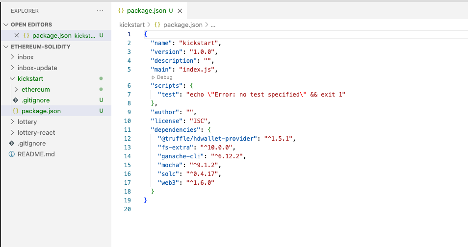

#   How to setup project - Kickstart

##  Initialize Project - Kickstart
-   `mkdir kickstart`
-   `cd kickstart`
-   `npm init`

##  Installing Modules

**install ganache-cli mocha solc@0.4.17 fs-extra web3 @truffle/hdwallet-provider and dotenv** 
```
npm install ganache-cli mocha solc@0.4.17 fs-extra web3 @truffle/hdwallet-provider dotenv
```
<details>
  <summary>Installing Modules - result</summary>


---
</details>  

## Create a Campaign.sol
<details>
  <summary>Campaign.sol</summary>

```
pragma solidity ^0.4.17;

contract CampaignFactory {
    address[] public deployedCampaigns;

    function createCampaign(uint minimum) public {
        address newCampaign = new Campaign(minimum, msg.sender);
        deployedCampaigns.push(newCampaign);
    }

    function getDeployedCampaigns() public view returns (address[]) {
        return deployedCampaigns;
    }
}

contract Campaign {
    struct Request {
        string description;
        uint value;
        address recipient;
        bool complete;
        uint approvalCount;
        mapping(address => bool) approvals;
    }

    Request[] public requests;
    address public manager;
    uint public minimumContribution;
    mapping(address => bool) public approvers;
    uint public approversCount;

    modifier restricted() {
        require(msg.sender == manager);
        _;
    }

    function Campaign(uint minimum, address creator) public {
        manager = creator;
        minimumContribution = minimum;
    }

    function contribute() public payable {
        require(msg.value > minimumContribution);

        approvers[msg.sender] = true;
        approversCount++;
    }

    function createRequest(string description, uint value, address recipient) public restricted {
        Request memory newRequest = Request({
           description: description,
           value: value,
           recipient: recipient,
           complete: false,
           approvalCount: 0
        });

        requests.push(newRequest);
    }

    function approveRequest(uint index) public {
        Request storage request = requests[index];

        require(approvers[msg.sender]);
        require(!request.approvals[msg.sender]);

        request.approvals[msg.sender] = true;
        request.approvalCount++;
    }

    function finalizeRequest(uint index) public restricted {
        Request storage request = requests[index];

        require(request.approvalCount > (approversCount / 2));
        require(!request.complete);

        request.recipient.transfer(request.value);
        request.complete = true;
    }
}
```
</details>  
 
## create test files

<details>
  <summary>Campaign.test.js</summary>

```
const assert = require('assert');
const ganache = require('ganache-cli');
const Web3 = require('web3');
const web3 = new Web3(ganache.provider());

const compiledFactory = require('../ethereum/build/CampaignFactory.json');
const compiledCampaign = require('../ethereum/build/Campaign.json');
const { isTypedArray } = require('util/types');

let accounts;
let factory;
let campaignAddress;
let campaign;

beforeEach(async () => {
    accounts = await web3.eth.getAccounts();

    factory = await new web3.eth.Contract(JSON.parse(compiledFactory.interface))
        .deploy({data: compiledFactory.bytecode })
        .send({ from: accounts[0], gas: '1000000' });

    await factory.methods.createCampaign('100').send({
        from: accounts[0],
        gas: '1000000'
    });

    [campaignAddress] = await factory.methods.getDeployedCampaigns().call();
    campaign = await new web3.eth.Contract(
        JSON.parse(compiledCampaign.interface),
        campaignAddress
    );
});

describe('[Campaigns', () => {
    it('deploys a factory and a campain', () => {
        assert.ok(factory.options.address);
        assert.ok(campaign.options.address);
    });  
    
    it ('marks caller as teh campaign manager', async () => {
        const manager = await campaign.methods.manager().call();
        assert.equal(accounts[0], manager);
    });

    it ('allows people to contribute monfey and marks them as approvers', async () => {
        await campaign.methods.contribute().send({
            value: '200',
            from: accounts[1]
        });  
        const isContributor = await campaign.methods.approvers(accounts[1]).call();  
        assert(isContributor);
    })

    it ('requires a minimum contribution', async () => {
        try {
            await campaign.methods.contribute().send({
                value: '5',
                from: accounts[1]
            });
            assert(false);
        }catch (err) {            
            assert(err);
        }
    });

    it('allows a manager to make a payment request', async () => {
        await campaign.methods
            .createRequest('Buy batteries', '100', accounts[1])
            .send({
                from: accounts[0],
                gas: '1000000'
            });
        const request = await campaign.methods.requests(0).call();

        assert.equal('Buy batteries', request.description);        
    });

    it ('processes requests', async () => {
        await campaign.methods.contribute().send({
            from: accounts[0],
            value: web3.utils.toWei('10', 'ether')
        });

        await campaign.methods
            .createRequest('A', web3.utils.toWei('5', 'ether'), accounts[1])
            .send({ from: accounts[0], gas: '1000000'});

        await campaign.methods.approveRequest(0).send({
            from: accounts[0],
            gas: '1000000'
        });

        await campaign.methods.finalizeRequest(0).send({
            from: accounts[0],
            gas: '1000000'
        });

        let balance = await web3.eth.getBalance(accounts[1]);
        balance = web3.utils.fromWei(balance, 'ether');
        balance = parseFloat(balance);

        // console.log(balance);
        assert(balance > 104);
    });
});
```
</details>  

**Testing with Mocha** 

-   change the `package.json`
    ```
    "scripts": {
        "test": "echo \"Error: no test specified\" && exit 1"
    }
    ```
    to
    ```
    "scripts": {
        "test": "mocha"
    }
    ```
-   run Mocha test 
    ```
    npm run test
    ```
<details>
  <summary>If the following Error: 0308010C:digital envelope routines::unsupported</summary>

    ```
    Error: error:0308010C:digital envelope routines::unsupported
        at new Hash (node:internal/crypto/hash:67:19)
        at Object.createHash (node:crypto:130:10)
        at module.exports (/Users/user/Programming Documents/WebServer/untitled/node_modules/webpack/lib/util/createHash.js:135:53)
        at NormalModule._initBuildHash (/Users/user/Programming Documents/WebServer/untitled/node_modules/webpack/lib/NormalModule.js:417:16)
        at handleParseError (/Users/user/Programming Documents/WebServer/untitled/node_modules/webpack/lib/NormalModule.js:471:10)
        at /Users/user/Programming Documents/WebServer/untitled/node_modules/webpack/lib/NormalModule.js:503:5
        at /Users/user/Programming Documents/WebServer/untitled/node_modules/webpack/lib/NormalModule.js:358:12
        at /Users/user/Programming Documents/WebServer/untitled/node_modules/loader-runner/lib/LoaderRunner.js:373:3
        at iterateNormalLoaders (/Users/user/Programming Documents/WebServer/untitled/node_modules/loader-runner/lib/LoaderRunner.js:214:10)
        at iterateNormalLoaders (/Users/user/Programming Documents/WebServer/untitled/node_modules/loader-runner/lib/LoaderRunner.js:221:10)
    /Users/user/Programming Documents/WebServer/untitled/node_modules/react-scripts/scripts/start.js:19
    throw err;
    ^
    ```

**Open terminal and paste these as described :**

-   Linux & Mac OS (windows git bash)-
    ```
    export NODE_OPTIONS=--openssl-legacy-provider
    ```

- [Error message "error:0308010C:digital envelope routines::unsupported"](https://stackoverflow.com/questions/69692842/error-message-error0308010cdigital-envelope-routinesunsupported)
</details> 

## **Create compile.js**
<details>
  <summary>compile.js</summary>

```
const path = require("path");
const solc = require("solc");
const fs = require("fs-extra");

const buildPath = path.resolve(__dirname, "build");
fs.removeSync(buildPath);

const campaignPath = path.resolve(__dirname, "contracts", "Campaign.sol");
const source = fs.readFileSync(campaignPath, "utf8");
const output = solc.compile(source, 1).contracts;

fs.ensureDirSync(buildPath);

for (let contract in output) {
  fs.outputJsonSync(
    path.resolve(buildPath, contract.replace(':', '') + ".json"),
    output[contract]
  );
}
```
</details>  

**run `node compile.js`**

-   in terminal run 
```
node compile.js
```

<details>
  <summary>compile - issues</summary>

```
In the upcoming lecture, we will be logging the compilation of our script to the terminal. If you are using **solc 0.4.17** as shown in the course, you may get these warnings:

*Invalid asm.js: Invalid member of stdlib*

or

*':6:5: Warning: Defining constructors as functions with the same name as the contract is deprecated. Use "constructor(...) { ... }" instead.\n' +*

'    function Inbox(string initialMessage) public {\n' +

'    ^ (Relevant source part starts here and spans across multiple lines).\n'

**These specific warnings can be ignored as they will not cause any issues with the compilation or deployment of the contract we are building.**
```
</details>  

## Infura Signup

-   [infura.io](https://infura.io/)

##  Wallet Provider Setup

-   Wallet Provider Setup
    ```
    npm install @truffle/hdwallet-provider
    ```
## Create deploy.js 
<details>
  <summary>deploy.js</summary>

```
const HDWalletProvider = require('@truffle/hdwallet-provider');
const Web3 = require('web3');
const compiledFactory = require('./build/CampaignFactory.json');

const { 
  metamaskSRP, 
  infuraRinkebyEndpoint, 
  infuraGorliEndpoint, 
  infuraSepoliaEndpoint 
} = require('./secret');

const provider = new HDWalletProvider(
  metamaskSRP,   // remember to change this to your own phrase!
  infuraRinkebyEndpoint   // remember to change this to your own endpoint!
);
const web3 = new Web3(provider);

const deploy = async () => {
  const accounts = await web3.eth.getAccounts();

  console.log('Attempting to deploy from account', accounts[0]);

  const result = await new web3.eth.Contract(JSON.parse(compiledFactory.interface))
    .deploy({ data: compiledFactory.bytecode })
    .send({ gas: '1000000', from: accounts[0] });

  console.log('Contract deployed to infuraRinkebyEndpoint', result.options.address);
  provider.engine.stop();
};
deploy();
```
</details>

**Create secrest folder and .env**

-   install dotenv
    ```
    npm install dotenv
    ```
`secret/index.js`    
```
require('dotenv').config() 

module.exports = {
  metamaskSRP: process.env.metamaskSRP,
  infuraRinkebyEndpoint: process.env.infuraRinkebyEndpoint,
  infuraGorliEndpoint: process.env.infuraGorliEndpoint,
  infuraSepoliaEndpoint: process.env.infuraSepoliaEndpoint,
}
```

`.env`
```
metamaskSRP = 'this is your own phrase'
infuraRinkebyEndpoint = 'this is your Rinkeby endpoint'
infuraGorliEndpoint = 'this is your Goeril endpoint'
infuraSepoliaEndpoint = 'this is your Sepolia endpoint'
```

**Deployment** 

-   Deployment 
    ```
    node deploy.js
    ```
## Next.js

**Install next.js**
```
npm install next react react-dom
```

**Create pages/show.js pages/newcampaign.js**

- under kickstart root directory
```
mkdie pages
cd pages
touch show.js
touch newcampaign.js
```    